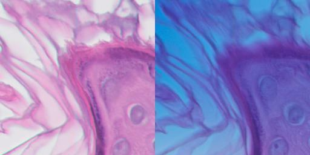

# Pairwise Patch Extraction
This module aims at extracting patches from a pair of whole slide images.
  
To start **pairwise** patch extraction, like [extract patches from a single case](./patch_extraction.md#extract-patches-from-a-single-wsi-save-to-jpeg-files), you need to [define a tissue detector](../tissue_detection/tissue_detector.md) to identify the foreground of a WSI. Other than that you also need a ```WSI_CaseManager``` to help you to find the WSI counterpart, which maintains the correspondence in a MS Excel file.  
In order to create the patch location correspondence, you also need a ```OffsetCSVManager``` to help us to maintain the shifting offsets between WSI pairs. The offsets can be obtained from both [automatic registration](../wsi_registration/wsi_registration.md) and [annotation](../wsi_annotation/QuPath_scripts/readme.md). 

You may also need to specify some parameters to customise your extraction. All the parameters are warped in ```PairwiseExtractorParameters``` of [pairwise_patch_extractor.py](../../wsitools/patch_extraction/pairwise_patch_extractor.py). Read the comments in the file to get more details. 

If you save extracted patches into JPG or PNG, each pair will be saved in one file and look like below.


### Extract patches from a single pair of WSIs
To extract patches from a single WSI, you can write your code like below.    
Currently, we don't provide acceleration for single case patch extraction
```python
fixed_wsi = "/projects/WSIs/MELF/d83cc7d1c941438e93786fc381ab5bb5.tiff"
float_wsi_root_dir = "/projects/WSIs/MELF-Clean"

from wsitools.file_management.wsi_case_manager import WSI_CaseManager  # import dependent packages
from wsitools.file_management.offset_csv_manager import OffsetCSVManager
from wsitools.tissue_detection.tissue_detector import TissueDetector
from wsitools.patch_extraction.pairwise_patch_extractor import PairwiseExtractorParameters, PairwisePatchExtractor

gnb_training_files = "../tissue_detection/model_files/HE_tissue_others.tsv"
tissue_detector = TissueDetector("GNB", threshold=0.5, training_files=gnb_training_files)

case_mn = WSI_CaseManager()
float_wsi = case_mn.get_counterpart_fn(fixed_wsi, float_wsi_root_dir)
_, fixed_wsi_uuid, _ = case_mn.get_wsi_fn_info(fixed_wsi)
_, float_wsi_uuid, _ = case_mn.get_wsi_fn_info(float_wsi)
offset_csv_fn = "../file_management/example/wsi_pair_offset.csv"
offset_csv_mn = OffsetCSVManager(offset_csv_fn)
offset, state_indicator = offset_csv_mn.lookup_table(fixed_wsi_uuid, float_wsi_uuid)
if state_indicator == 0:
    raise Exception("No corresponding offset can be found in the file")
output_dir = "/projects/data/temp"
parameters = PairwiseExtractorParameters(output_dir, save_format='.jpg', sample_cnt=-1)
patch_extractor = PairwisePatchExtractor(tissue_detector, parameters, feature_map=None, annotations=None)
patch_cnt = patch_extractor.extract(fixed_wsi, float_wsi, offset)
print("%d Patches have been save to %s" % (patch_cnt, output_dir))
```

### Extract patches from multiple pairs of WSIs
All the file names of WSIs to be processed can be listed in a text file [(example)](../../wsitools/file_management/example/case_list.txt), so that it can be easily managed.
Multiprocessing can be adopted to accelerate the extraction.
```python
from wsitools.file_management.wsi_case_manager import WSI_CaseManager  # # import dependent packages
from wsitools.file_management.offset_csv_manager import OffsetCSVManager
from wsitools.file_management.case_list_manager import CaseListManager
from wsitools.tissue_detection.tissue_detector import TissueDetector
from wsitools.patch_extraction.pairwise_patch_extractor import PairwiseExtractorParameters, PairwisePatchExtractor
import multiprocessing

float_wsi_root_dir = "/projects/WSIs/MELF-Clean"

gnb_training_files = "../tissue_detection/model_files/HE_tissue_others.tsv"
tissue_detector = TissueDetector("GNB", threshold=0.5, training_files=gnb_training_files)

offset_csv_fn = "../file_management/example/wsi_pair_offset.csv"
offset_csv_mn = OffsetCSVManager(offset_csv_fn)

case_list_txt = "../file_management/example/case_list.txt"
case_list_mn = CaseListManager(case_list_txt)
all_fixed_wsi_fn = case_list_mn.case_list

case_pair_mn = WSI_CaseManager()

all_fixed_float_offset = []
for fixed_wsi in all_fixed_wsi_fn:
    float_wsi = case_pair_mn.get_counterpart_fn(fixed_wsi, float_wsi_root_dir)
    _, fixed_wsi_uuid, _ = case_pair_mn.get_wsi_fn_info(fixed_wsi)
    _, float_wsi_uuid, _ = case_pair_mn.get_wsi_fn_info(float_wsi)

    offset, state_indicator = offset_csv_mn.lookup_table(fixed_wsi_uuid, float_wsi_uuid)
    if state_indicator == 0:
        raise Exception("No corresponding offset can be found in the file")
    all_fixed_float_offset.append((fixed_wsi, float_wsi, offset))

# extract pairs of patches without annotation, no feature map specified and save patches to '.jpg'
output_dir = "/projects/data/temp"
parameters = PairwiseExtractorParameters(output_dir, save_format='.jpg', sample_cnt=-1)
patch_extractor = PairwisePatchExtractor(tissue_detector, parameters, feature_map=None, annotations=None)

multiprocessing.set_start_method('spawn')
pool = multiprocessing.Pool(processes=4)
pool.map(patch_extractor.extract_parallel, all_fixed_float_offset)
```

### Extract patches from a single pair of WSIs, and save into tfRecords
TensorFlow tfRecord provide an efficient way to write and read structured data.
If you would like to save the extracted patches and some other information into tfRecords, you may need to [customize your own feature map](./feature_map.md).
```python
from wsitools.file_management.wsi_case_manager import WSI_CaseManager  # # import dependent packages
from wsitools.file_management.offset_csv_manager import OffsetCSVManager
from wsitools.tissue_detection.tissue_detector import TissueDetector
from wsitools.patch_extraction.feature_map_creator import FeatureMapCreator
from wsitools.patch_extraction.pairwise_patch_extractor import PairwiseExtractorParameters, PairwisePatchExtractor

fixed_wsi = "/projects/WSIs/MELF/7bb50b5d9dcf4e53ad311d66136ae00f.tiff"
float_wsi_root_dir = "/projects/WSIs/MELF-Clean"

gnb_training_files = "wsitools/tissue_detection/model_files/HE_tissue_others.tsv"
tissue_detector = TissueDetector("GNB", threshold=0.5, training_files=gnb_training_files)

offset_csv_fn = "/projects/WSIs/registration_offsets.csv"
offset_csv_mn = OffsetCSVManager(offset_csv_fn)

fm = FeatureMapCreator("wsitools/patch_extraction/feature_maps/basic_fm_PP_eval.csv")

case_mn = WSI_CaseManager()
float_wsi = case_mn.get_counterpart_fn(fixed_wsi, float_wsi_root_dir)
_, fixed_wsi_uuid, _ = case_mn.get_wsi_fn_info(fixed_wsi)
_, float_wsi_uuid, _ = case_mn.get_wsi_fn_info(float_wsi)

offset, state_indicator = offset_csv_mn.lookup_table(fixed_wsi_uuid, float_wsi_uuid)
if state_indicator == 0:
    raise Exception("No corresponding offset can be found in the file")

output_dir = "/projects/temp"
parameters = PairwiseExtractorParameters(output_dir, save_format='.tfrecord', sample_cnt=-1)
patch_extractor = PairwisePatchExtractor(tissue_detector, parameters, feature_map=fm, annotations=None)
patch_cnt = patch_extractor.extract(fixed_wsi, float_wsi, offset)
print("%d Patches have been save to %s" % (patch_cnt, output_dir))

```


